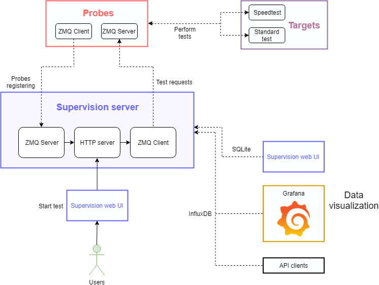

The goal of this project is to start tests (ping/jitter/packet loss/mos/download/upload) from a client 
(it can be anything as long as it meets requirements) to a target to monitor network between the client and the target.
Our project has been developed for Windows, Linux and IOT and is very easy to deploy 
(Automatic deployment for IOT and installation and configuration scripts for Windows and Linux).
You can supervise your network in less than 10 minutes.

#### Architecture


# This tool uses :

* [Flask](http://flask.pocoo.org/) - Web microframework
* [Gunicorn](https://gunicorn.org/) - WSGI HTTP Server for UNIX
* [Jinja2](http://jinja.pocoo.org/) - Template engine
* [Bulma](https://bulma.io/) - CSS framework
* [PyZMQ](http://zguide.zeromq.org/py:all) - Python bindings for ØMQ
* [Requests](http://docs.python-requests.org/) - HTTP library
* [Balena](https://www.balena.io/) - Container-based platform for deploying IoT applications

# Requirements

#### Server Python
*  Debian (Windows will use a developpement server not recommended for production)
*  Python 3.6 or newer (Standard method only)
*  Pip (Standard method only)
*  Docker (Lazy method only)

#### Client Python
*  Python 3.6 or newer (Standard method only)
*  Pip (Standard method only)
*  Docker (Lazy method only)
*  iPerf3 (Linux only)

# Install and start the application

Download or clone –> https://github.com/lyon-esport/Supervision.git

Extract the Supervision files

You have 2 methods : 

*  Lazy method will install and configure everything (Python, Pip and dependencies)

*  Standard method needs #Requirements

## Lazy method

#### Server Python

Windows : Start Server/lazy_server_windows.ps1


Linux : 
1. Use dockerfile Server/Dockerfile
2. Set config
    * SERVER_ZMQ_FIRST_PORT (First ZMQ port server)
    * SERVER_ZMQ_NB_PORT (Number of ZMQ server)
    * INFLUXDB_URL (Influxdb URL for autotest) - optionnal
3. Set expose server port with all ZMQ port server
4. Build the docker `docker build -t server .`
5. Run the docker `docker run -d --restart=always -p 80:80 -p <FIRST_ZMQ_PORT-LAST_ZMQ_PORT:FIRST_ZMQ_PORT-LAST_ZMQ_PORT> server`

#### Client Python

Windows : Start Client/lazy_client_windows.ps1

Linux : 
1. Use dockerfile Client/Dockerfile
2. Set config
    * PROBE_NAME
    * PROBE_IP
    * PROBE_PORT
    * SERVER_IP
    * SERVER_PORT
3. Set expose probe port with the same value (PROBE_PORT)
4. Build the docker `docker build -t client .`
5. Run the docker `docker run -d --restart=always -p 5201:5201 -p <PROBE_PORT:PROBE_PORT> client`

## Standard method

#### Server Python

1. Open a terminal in Server folder

2. Install the requirements: `pip install -r requirements.txt`

3. Create the database `python database_setup.py` to generate the database file (database.sqlite will appear)

4. Create `config/server.json` with the correct settings (example : `config/server.example`)

5. Open a terminal in Server folder

6. Linux : 

        gunicorn server:app --bind 0.0.0.0:80
        
   Windows :
   
        set FLASK_APP=server.py
        python -m flask run --host=0.0.0.0 --port=80

7. Access the server on `http:myIPAdress:80/` **-> replace myIPAdress by your IP address** 

#### Client Python

1. Open a terminal in Client folder

2. Install the requirements: `pip install -r requirements.txt`

3. Create `config/clientZMQ.json` with the correct settings (example : `config/clientZMQ.example`)

4. Open a terminal in Client folder

5. Start the client with `python client.py`

# IOT

1. Create an account and an application on : https://www.balena.io/
2. Add Dockerfile.template to your balena project
3. Add your devices
4. Add and configure for each device 4 Environment Variables :
    * PROBE_IP
    * PROBE_NAME
    * SERVER_IP
    * SERVER_PORT
5. Deploy the application

# Usage guide

#### Index (Start a test)

1. Standard test

    The probe will start a test and will give you the ping/jitter/packet loss/mos. Standard test target can be anything (phone, laptop, server etc...), you just need to put the IP of the device.

2. Speedtest

    The probe will start a test and will give you the download and the upload speeds. Speedtest target is an iPerf server, you need to put the IP and the Port of the iPerf server and you can add iPerf options.

3. Autotest

    If checked, the probe will repeat a test each X seconds and will send the result to InfluxDB otherwise the probe will do one test and will save it in the local database.

4. Comment

    You can write what you want, this field is often used to write a comment about the test performed.

#### Settings (Add/edit/delete a server)

If you want to save time, you can save `Standard test` and `Speedtest` servers.

#### Archive (See and manage your test)

You have two types of test : `test` and `autotest`

*  `test` will be saved in a local database (sqlite) and will be visible on the archive page.

*  `autotest` will be saved in InfluxDB database.

#### Autotest (Delete autotest)

You can see all autotest launched and you can stop them.

#### Autotest_json (Get last test as JSON format)

You need to provide two get parameters `address` and `port`, it's the address and port of your probe (example : http://127.0.0.1/autotest_json?address=127.0.0.1&port=5000).
It will return the last test (can be an autotest or a standard test) formated as JSON.
To check if it's a new result compare the field `version` (it will increment after each test performed).
When you start your server the version will be equal to 0 and version depends of the ZMQServer.
For example if a probe (Probe_A) is connected on port 4000, after 10 minutes you shutdown the probe and you connect an other one (Probe_B) on port 4000.
The value of field `version` for the first test of Probe_B will be equal to the last value of Probe_A + 1.

Example :
```
{
    "version":1,
    "type":"result",
    "id": 1,                        //[OPTIONAL] id of test for SQLite database ("Standard test" only)
    "probe_name": "Probe_A",        //probe name
    "ping": {                       //[OPTIONAL] ("Standard test" only)
        "avg":23.67,                    //ping average value
        "max":31,                       //ping minimum value
        "min":21                        //ping maximum value
    },
    "jitter": "1.79",               //[OPTIONAL] jitter value  ("Standard test" only)
    "packet_loss": {                //[OPTIONAL] ("Standard test" only)
        "packet_number":0,              //number of packet loss
        "packet_percent":0.0            //percentage of packet loss
    },
    "mos": "4.40",                  //[OPTIONAL] mos value  ("Standard test" only)
    "packet_number": 100,           //[OPTIONAL] number of packet send  ("Standard test" only)
    "packet_timeout": 3,            //[OPTIONAL] timeout for each packet sent  ("Standard test" only)
    "speedtest": {                  //[OPTIONAL] (Autotest only)
        "download":                     //[OPTIONAL] ("Download" test and "Download and Upload" test Only)
        {
            "status": "success",            //test success = success, test fail = error
            "message": "message",           //[OPTIONAL] error message (only if status=error)
            "result": {                     //[OPTIONAL] (only if status=success)
                "avg": 40,                      //bandwidth average value
                "min": 30,                      //bandwidth minimum value
                "max": 50                       //bandwidth maximum value
            },
            "json": {...}                   //[OPTIONAL] json result of iperf (only if error is an iperf error)
        },
        "upload":                       //[OPTIONAL] ("Upload" test and "Download and Upload" test Only)
        {
            "status": "success",            //test success = success, test fail = error
            "message": "message",           //[OPTIONAL] error message (only if status=error)
            "result": {                     //[OPTIONAL] (only if status=success)
                "avg": 40,                  //bandwidth average value
                "min": 30,                  //bandwidth minimum value
                "max": 50                   //bandwidth maximum value
            },
            "json": {...}                   //[OPTIONAL] json result of iperf (only if error is an iperf error)
        }
    },
    "speedtest_option": "result",   //[OPTIONAL] iperf option  ("Autotest" only)
    "comment": "result",            //your comment
    "influxdb": false,              //"Standard test" = false, "Autotest" = true
    "status": "done",               //test performed = "done", test not performed = "error"
}
```
## HTTP request InfluxDB

All query forwarded to InfluxDB.

#### For standard test

*  packet number-> `packet_number,probe=<probe_name> value=<packet_number>`

*  packet timeout-> `packet_timeout,probe=<probe_name> value=<packet_timeout>`

*  ping -> `ping,probe=<probe_name> min=<min_ping>, max=<max_ping>, avg=<average_ping>`

*  jitter -> `jitter,probe=<probe_name> value=<jitter_value>`

*  packet_loss -> `packet_loss,probe=<probe_name> number=<pack_loss_number>, percent=<packet_loss_percent>`

*  mos -> `mos,probe=<probe_name> value=<mos_value>`

#### For speedtest

*  download -> `download,probe=<probe_name> min=<min_download>, max=<max_download>, avg=<average_download>`

*  upload -> `upload,probe=<probe_name> min=<min_upload>, max=<max_upload>, avg=<average_upload>`

*  speedtest option-> `speedtest_option,probe=<probe_name> value=<speedtest_option>`

#### For standard test and speedtest

*  comment -> `comment,probe=<probe_name> value=<test_comment>`

# Licence

The code is under CeCILL license.

You can find all details here: http://www.cecill.info/licences/Licence_CeCILL_V2.1-en.html

# Credits

Copyright © Lyon e-Sport, 2018

Contributor(s):

-Ortega Ludovic - ludovic.ortega@lyon-esport.fr

-Etienne Guilluy - etienne.guilluy@lyon-esport.fr

-Barbou Théo - theobarbou@gmail.com

-Dupessy Clément - clement07131@hotmail.fr

-Julian Marty - julian.marty83@gmail.com
